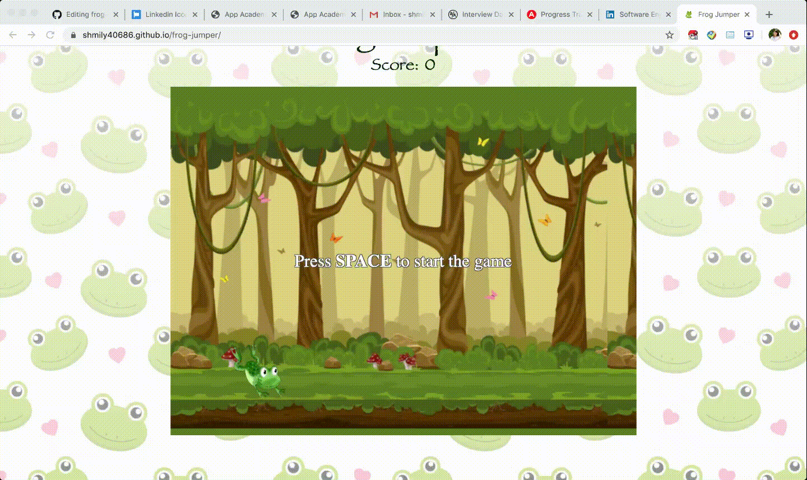
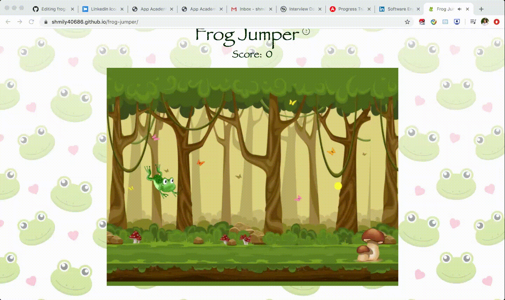

# Frog Jumper

A platform game featuring a jumping frog, Hoppy!

[Try it now!](https://shmily40686.github.io/frog-jumper/)

## Background and Overview

Frog Jumper was created using the following technologies:

  * JavaScript
  * HTML5
  * CSS3
  
## Overview and Highlights 

### Overview

##### Main gameplay
 * Hoppy collects the floating beans to increase the player's score
 * Players control Hoppy to avoid mushrooms. Hitting a mushroom ends the game
 * The game can be reset after hitting a mushroom

##### Extras
 * Clicking the "?" next to the title will open an instructional popout
 * Github and LinkedIn links are provided at the top
 * Contact information is located in the footer
 * Sound effects were added to make the game more interactive and exciting
 
### Highlights

##### Hoppy running, oncoming beans and mushrooms


Classes were created for each type of object and a property for x-coordinate and y-coordinate are stored. This information is required to draw the entity.

```
  class Player {
    constructor(ctx, image, posY, speed) {
        this.x = 100;
        this.y = posY;
        ...
    }
    ...
  }
  
  class Bean {
    constructor(canvas, ctx, speed, discardCb) {
        this.x = canvas.width;
        this.y = heights[Math.floor(3 * Math.random())];
        ...
    }
    ...
  }
  
  class Mushroom {
    constructor(ctx, image, x, y, speed) {
        this.x = x;
        this.y = y;
        ...
    }
    ...
  }
```

Mushrooms and beans have a method that modifies their x position by a small amount. Hoppy has a constant x coordinate. These methods are invoked using requestAnimationFrame and provide the illusion of moving towards Hoppy.

```
    move() {
        this.x -= this.speed;
        ...
    }
```

The same logic is found in the background, so everything is changing x coordinates except for Hoppy. This makes it seem as though Hoppy is moving forward.

##### Collision



Collision detection is used to track whether Hoppy lands on/ runs into a mushroom. It is also used to capture when Hoppy collects a bean. The algorithms for this require knowing the positions of the player and the object in question.

Since canvas rendering describes an item's position as the coordinates of the top left corner, the algorithm changes if the player is on the left or right side of the mushroom. THen, we can just user a standard a^2 + b^2 = c^2 calculation to determine the distance.

```
    if (mushX > playerX + spacing || playerX - mushX >= spacing) {
        // collision not possible
        return false;
    } else {
        const xDifference = Math.abs(mushX - playerX);
        const yDifference = Math.abs(mushY - playerY);

        if (mushX - playerX < spacing) {
            return Math.sqrt((xDifference * xDifference) + (yDifference * yDifference)) < spacing;
        } else {
            return Math.sqrt((xDifference * xDifference) + (yDifference * yDifference)) < spacing / 3;
        }
    }
```

##### Hoppy jump



To let Hoppy jump when the player presses Space, an event listener was added to the DOM to detect when the spacebar was pressed.

`window.addEventListener('keydown', game.jump);`

This triggers a method on the player class where the y value is changed repeatedly to create the arc of the jump.

```
    jumpImage() {
        const gravity = 0.40;
        const initialSpeed = 12;
        if (this.y > 200 && this.jumping) {
            this.y -= initialSpeed - gravity ;
            requestAnimationFrame(this.jumpImage)
        } else {
            this.jumping = false
            if (this.y >= 440) {
                return
            } else {
                this.y += this.speed;
                requestAnimationFrame(this.jumpImage)
            }
        }
    }
```

### Upcoming features

##### Saved scores

 * Using localStorage to keep track of high scores
 * Adding different kinds of obstacles instead of only mushrooms
 * Adding different colored beans for different point values

## Created by
  [Xiaowen Ling](https://github.com/shmily40686)
